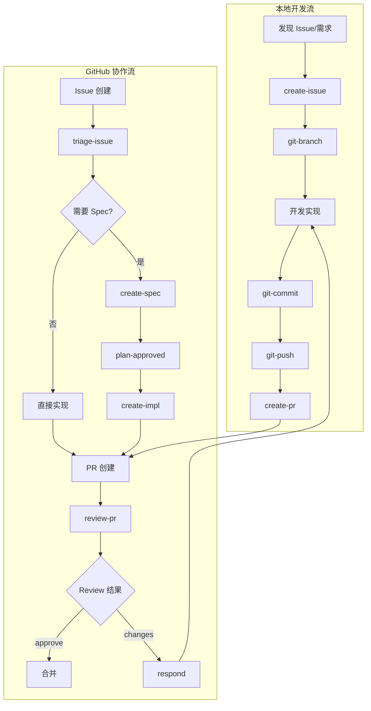
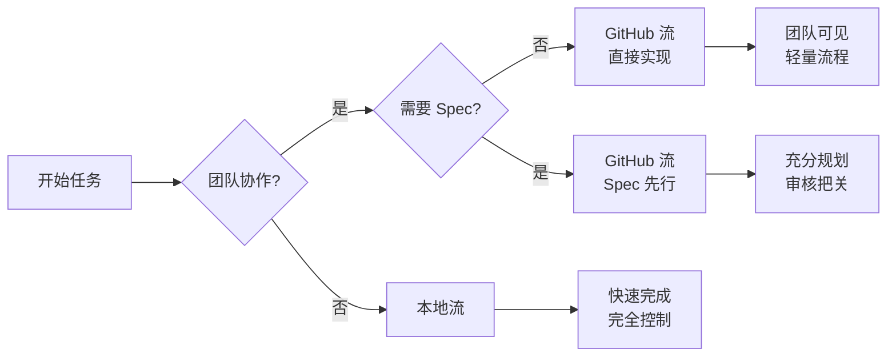

# DevForge-Flow (AICodingFlow)

> AI Coding 工作流模板系统 —— 连接本地 OpenCode Skills、GitHub Actions、PR Review 自动化、Issue Triage 和 Spec 驱动开发，从规划到合并的稳定、可复现路径。

---

## 目录

- [概述](#概述)
- [快速开始](#快速开始)
- [配置](#配置)
- [使用指南](#使用指南)
  - [本地开发流 Skills](#本地开发流-skills)
  - [GitHub 协作流 Workflows](#github-协作流-workflows)
- [团队工作流图](#团队工作流图)
- [快速参考](#快速参考)
- [目录结构](#目录结构)
- [文档索引](#文档索引)
- [贡献与反馈](#贡献与反馈)

---

## 概述

DevForge-Flow 提供两类核心能力：

| 流程 | 工具 | 适用场景 |
|------|------|----------|
| **本地开发流** | `create-issue`、`git-*`、`create-pr` Skills | 快速修复、小功能、个人实验 |
| **GitHub 协作流** | GitHub Actions + OpenCode | 团队协作、复杂功能、Spec 驱动开发 |

### 核心特性

| 特性 | 说明 |
|------|------|
| 🔧 **Spec 驱动开发** | `ready-to-spec` → product.md + tech.md → `plan-approved` → `ready-to-implement` |
| 🤖 **自动化 Triage** | 新 Issue 自动分类、标签、复现性评估、重复检测 |
| 👁️ **AI PR Review** | 自动审查 PR，生成 APPROVE/REJECT verdict + inline comments |
| 🔄 **闭环学习** | 人工反馈自动更新 Companion Skills（`review-pr-repo`, `dedupe-issue-repo`） |
| 🛡️ **安全护栏** | 保护标签控制、禁止伪造 Issue ID、禁止 force push |

---

## 快速开始

### 一行安装

```bash
curl -fsSL https://raw.githubusercontent.com/jialinamazon404/DevForge-Flow/main/install.sh | bash -s -- --target /path/to/target-repo
```

### 克隆安装

```bash
git clone https://github.com/jialinamazon404/DevForge-Flow.git
cd DevForge-Flow
./install.sh --target /path/to/target-repo
```

### 预览变更

```bash
./install.sh --target /path/to/target-repo --dry-run
```

### 依赖

安装脚本需要：`bash`、`git`、`rsync`（一行安装还需 `curl`）

**同步内容**：
- `.agents/skills/` — OpenCode Skills
- `.github/scripts/` — Python 辅助脚本
- `.github/aicodingflow-tests/` — 测试和 fixtures
- `.github/workflows/` — 受管工作流（不含 `ci.yml`）

---

## 配置

安装后在目标仓库配置以下 Secrets 和 Variables：

### 必需配置

| 名称 | 类型 | 用途 |
|------|------|------|
| `AGENT_API_KEY` | Secret | OpenCode API Key（如 Anthropic API Key） |
| `AGENT_MODEL` | Variable | 模型名称，如 `anthropic/claude-sonnet-4-20250514` |
| `AGENT_LOGIN` | Variable | Agent GitHub 登录名，用于 Issue/PR mention |

### 可选配置

| 名称 | 类型 | 用途 |
|------|------|------|
| `REVIEW_BOT_LOGIN` | Variable | Review Bot 登录名（默认 `github-actions[bot]`） |
| `APP_CLIENT_ID` | Variable | GitHub App Client ID（用于更新 workflow 文件） |
| `APP_PRIVATE_KEY` | Secret | GitHub App Private Key（需 `Contents` + `Workflows` 写权限） |

### 初始化 Triage 配置

首次接入时，在 OpenCode 运行：

```text
$bootstrap-issue-config
```

自动生成：
- `.github/issue-triage/config.json` — Label 定义
- `.github/CODEOWNERS` — 代码所有权

---

## 使用指南

### 本地开发流 Skills

> 本地 Skills 在 OpenCode 中按名称调用，如 `$create-issue`、`$git-branch`

---

#### 📝 create-issue

**用途**：从对话上下文创建 GitHub Issue

**工作流**：
1. 查找仓库根目录和 Issue 模板
2. 分类请求 → 选择模板（bug/feature/docs）
3. 安全报告 → 私有渠道（禁止公开敏感细节）
4. 构建标题/正文（仅用事实，禁止伪造元数据）
5. `gh issue create` 提交

**关键参数**（隐含于上下文）：

| 参数 | 来源 | 说明 |
|------|------|------|
| 模板选择 | 请求类型 | bug → bug 模板，feature → feature 模板 |
| Labels | 默认不添加 | 让 Triage 工作流自动分类 |
| Assignees | 明确请求时 | 不自动添加 |

**安全规则**：
- ❌ 禁止公开 secrets、credentials、private keys
- ❌ 禁止 raw HTTP fallback（只用 GitHub CLI）
- ❌ 禁止从此 Skill 创建 labels/milestones/branches/PRs

---

#### 🌿 git-branch

**用途**：创建符合仓库规范的分支

**命名格式**：`<type>/<short-desc>-<issueID>`

| 类型 | 说明 |
|------|------|
| `feat` | 新功能 |
| `fix` | Bug 修复 |
| `refactor` | 重构 |
| `docs` | 文档 |
| `test` | 测试 |
| `spec` | 仅 Spec |
| `impl` | 从 Spec 实现 |

**工作流**：
1. 从 Issue 或用户输入确定分支名
2. `git check-ref-format --branch` 验证名称
3. 检查本地/远程状态
4. `git switch -c <branch> <base>` 创建

**参数**：

| 参数 | 来源 | 默认值 |
|------|------|--------|
| `type` | Issue 上下文 | `chore` |
| `short-desc` | Issue 标题（`gh issue view`） | - |
| `issueID` | 上下文引用 | - |
| `base` | 仓库指导 | `main` |

**安全规则**：
- ❌ 禁止 overwrite/reset/stash/delete（除非明确请求）
- ❌ 禁止创建保护分支（`main`/`master`/`develop`）
- ❌ 禁止伪造 Issue ID

---

#### 🏠 git-worktree

**用途**：创建隔离 Git Worktree 用于并行工作

**工作流**：
1. 确定路径（`.worktrees/<branch>`）
2. 检查冲突
3. `git worktree add <path> <branch>`
4. 报告位置

**参数**：

| 参数 | 来源 | 默认值 |
|------|------|--------|
| `path` | 用户输入 | `.worktrees/<branch>` |
| `branch` | 上下文 | - |
| `base` | 新分支时 | `main` |

**安全规则**：
- ❌ 禁止移除 Worktree（除非明确请求）
- ✅ `.worktrees/` 必须保留在 `.gitignore`

---

#### 💾 git-commit

**用途**：从真实 Diff 创建原子提交

**提交格式**：`type(scope): summary`

**Issue 关联**：
- `Fixes #123` — 关闭 Issue
- `Refs #123` — 部分/准备工作

**工作流**：
1. `git status` / `git diff` 检查变更
2. 确定提交边界（分离关注点）
3. 只暂存意图文件
4. Conventional Commit 格式构建消息
5. Hooks 启用提交

**参数**：

| 参数 | 来源 | 默认值 |
|------|------|--------|
| `type` | 变更性质 | `feat`/`fix` 等 |
| `scope` | 模块 | 可选 |
| `summary` | Diff 描述 | 从 Diff |
| `issueID` | 分支模式或显式 | - |

**安全规则**：
- ❌ 禁止 `--no-verify`（除非明确请求）
- ❌ 禁止 push/重写历史/force
- ✅ 报告 Hook 失败，不绕过

---

#### ⬆️ git-push

**用途**：安全推送已提交分支

**工作流**：
1. 验证分支已提交
2. 检查远程状态（无分歧）
3. `git push -u origin <branch>`

**参数**：

| 参数 | 来源 | 默认值 |
|------|------|--------|
| `remote` | 仓库配置 | `origin` |
| `branch` | 当前分支 | - |
| `force` | 永不 | `false` |

**安全规则**：
- ❌ 禁止 force push（除非明确请求）
- ✅ 分歧时警告，不自动解决

---

#### 🔀 create-pr

**用途**：创建或更新 GitHub Pull Request

**标题格式**：`[#123] type(scope): summary`

**Summary 模板**：
```markdown
## What
[一行描述]

## Why
[变更原因]

## How
[关键实现]

## Testing
[如何测试]
```

**工作流**：
1. 验证分支已推送
2. 如需与 base 同步
3. 构建 PR 标题/正文
4. `gh pr create`
5. 关联 Issue

**参数**（从 `pr-metadata.json` 或上下文）：

| 参数 | 来源 | 必需 |
|------|------|------|
| `branch_name` | 上下文 | ✅ |
| `pr_title` | 上下文 | ✅ |
| `pr_summary` | 上下文 | 可选 |
| `intended_files` | 上下文 | 可选 |

**安全规则**：
- ✅ 请求时先运行 Review
- ❌ 禁止合并/关闭 PR

---

### GitHub 协作流 Workflows

> GitHub Actions 自动化 Triage、Spec 创建、Implementation、Review

---

#### 🔍 triage-issue.yml

**触发条件**：
- `issues: opened, reopened`
- `issue_comment: created`（非 Bot）
- `workflow_dispatch` 带 `issue` 输入

**输入参数**：

| 输入 | 必需 | 默认值 | 说明 |
|------|------|--------|------|
| `issue` | ✅（dispatch） | - | Issue 编号 |
| `agent_login` | 可选 | `AGENT_LOGIN` | Agent 登录 |
| `include_issue_body` | 可选 | `true` | 包含 Issue 正文 |

**输出**：`triage_result.json`

| 字段 | 类型 | 说明 |
|------|------|------|
| `labels` | `array[string]` | 要应用的标签 |
| `repro` | `string` | 复现性（`high`/`medium`/`low`/`unknown`） |
| `confidence` | `string` | 置信度（`high`/`medium`/`low`） |
| `related_files` | `array[string]` | 相关文件路径 |
| `root_cause` | `string` | 根本原因评估 |
| `summary` | `string` | Triage 结论 |
| `follow_up_questions` | `array` | 向作者提问 |
| `duplicate_of` | `array` | 重复候选 |

**约束**：
- ❌ 禁止包含保护标签（`ready-to-spec`/`ready-to-implement`/`plan-approved`）
- `duplicate_of` 和 `follow_up_questions` 互斥

---

#### 📋 create-spec-from-issue.yml

**触发**：Issue 获得 `ready-to-spec` 标签

**输出**：
- `specs/issue-<N>/product.md` — Product Spec（行为、UX）
- `specs/issue-<N>/tech.md` — Tech Spec（架构、实现）
- Spec PR 供人工审核

---

#### ✅ plan-approved.yml

**触发**：Spec PR 合并 → Issue 获得 `plan-approved`

**行为**：
- 检查实现关口（无冲突、依赖满足）
- 通过 → `ready-to-implement`
- 失败 → 评论说明阻塞

---

#### 🔨 create-implementation-from-issue.yml

**触发**：Issue 获得 `ready-to-implement`

**输出**：
- Feature 分支上的实现提交
- 实现 PR
- `implementation_summary.md`

---

#### 👁️ review-pr.yml

**触发**：
- `workflow_dispatch` 带 `pr_number`
- PR 评论含 `@AGENT_LOGIN /review`

**输入**：

| 输入 | 必需 | 说明 |
|------|------|------|
| `pr_number` | ✅（dispatch） | PR 编号 |

**输出**：`review.json`

| 字段 | 类型 | 说明 |
|------|------|------|
| `verdict` | `string` | `APPROVE`/`REJECT`/`COMMENT` |
| `body` | `string` | Review 汇总 |
| `comments` | `array` | 行内评论 |
| `recommended_reviewers` | `array` | 人工审核者（最多 1） |

---

#### 💬 respond-to-pr-comment.yml

**触发**：PR 评论含 `@AGENT_LOGIN` + 命令

**命令**：

| 命令 | 用途 |
|------|------|
| `/explain` | 解释代码变更 |
| `/implement` | 实现请求变更 |
| `/review` | 请求 AI Review |
| `/fix` | 修复问题 |
| `/approve` | 批准之前的 REQUEST_CHANGES |

---

#### 🔄 update-pr-review.yml

**触发**：人工修改 Bot PR Review

**行为**：更新 `review-pr-repo` Companion Skill

---

#### 🔍 update-dedupe.yml

**触发**：人工将 Issue 关闭为重复

**行为**：更新 `dedupe-issue-repo` Companion Skill

---

## 团队工作流图

### 整体协作流程



### 流程选择决策



---

## 快速参考

### 分支命名

| 类型 | 格式 | 示例 |
|------|------|------|
| 功能 | `feat/<desc>-<issue>` | `feat/add-retry-42` |
| 修复 | `fix/<desc>-<issue>` | `fix/null-input-15` |
| 重构 | `refactor/<desc>-<issue>` | `refactor/auth-33` |
| 文档 | `docs/<desc>-<issue>` | `docs/readme-7` |
| 测试 | `test/<desc>-<issue>` | `test/unit-21` |
| Spec | `spec/<desc>-<issue>` | `spec/api-99` |
| 实现 | `impl/<desc>-<issue>` | `impl/auth-99` |

### 提交格式

| 类型 | 格式 | 示例 |
|------|------|------|
| 功能 | `feat(scope): summary` | `feat(auth): add OAuth2` |
| 修复 | `fix(scope): summary` | `fix(api): handle null` |
| 文档 | `docs: summary` | `docs: update readme` |

### Issue Labels

| 类别 | Labels | 用途 |
|------|--------|------|
| **保护** | `ready-to-spec`, `ready-to-implement`, `plan-approved` | 工作流关口（禁止自动添加） |
| 流程 | `triaged`, `needs-info`, `duplicate` | Triage 处置 |
| 复现 | `repro:high`, `repro:medium`, `repro:low`, `repro:unknown` | 复现性 |
| 区域 | `area:workflow`, `area:skills`, `area:specs`, `area:tests` | 代码区域 |
| 类型 | `bug`, `enhancement`, `documentation` | Issue 类型 |

### PR 命令

| 命令 | 用途 |
|------|------|
| `/explain` | 解释代码 |
| `/implement` | 实现变更 |
| `/review` | 请求 AI Review |
| `/fix` | 修复问题 |
| `/approve` | 批准之前的拒绝 |

---

## 目录结构

```
.agents/                         # 多工具共享 Agent 配置
.agents/skills/                  # OpenCode/Codex Skills
.claude/                         # Claude 入口
.cursor/rules/                   # Cursor rules
.github/workflows/               # GitHub Actions
.github/scripts/                 # Python 辅助脚本
.github/aicodingflow-tests/      # 测试和 fixtures
.github/tests/                   # 自用测试
.github/issue-triage/            # Triage 配置
docs/                            # 详细文档
specs/                           # Issue Spec 目录
```

---

## 文档索引

| 文档 | 语言 | 内容 |
|------|------|------|
| [Conventions](docs/conventions.md) | 英文 | Git/Label/Spec/PR 规范、JSON Schema、最佳实践 |
| [规范文档](docs/conventions_CN.md) | 中文 | Git/Label/Spec/PR 规范（中文版） |
| [README_CN](docs/README_CN.md) | 中文 | 本文档中文版 |
| [本地开发流](docs/local-development-flow.md) | 中文 | Local Skills 详细说明 |
| [GitHub 协作流](docs/github-collaboration-flow.md) | 中文 | GitHub Actions 详细说明 |
| [Agent 目录](docs/agent-directories.md) | 中文 | `.agents`/`.claude`/`.cursor` 结构 |
| [自进化 Skills](docs/evolving-repo-skills.md) | 中文 | Companion Skill 自动更新 |

---

## 贡献与反馈

提交 Issue 或 PR 反馈。Bug 报告请包含：

- 📌 运行的 Skill 或 Workflow
- 🌿 分支名、Issue 编号、PR 链接
- 📝 命令输出或 GitHub Actions 日志
- 📦 Artifacts：
  - PR Review: `pr_description.txt`, `pr_diff.txt`, `spec_context.md`, `review.json`
  - Implementation: `issue_context.json`, `implementation_summary.md`, `pr-metadata.json`

### 测试命令

```bash
python3 -m unittest discover -s .github/tests
python3 -m unittest discover -s .github/aicodingflow-tests
```

---

> **License**: MIT | **Author**: jialin.chen | **Repo**: [jialinamazon404/DevForge-Flow](https://github.com/jialinamazon404/DevForge-Flow)