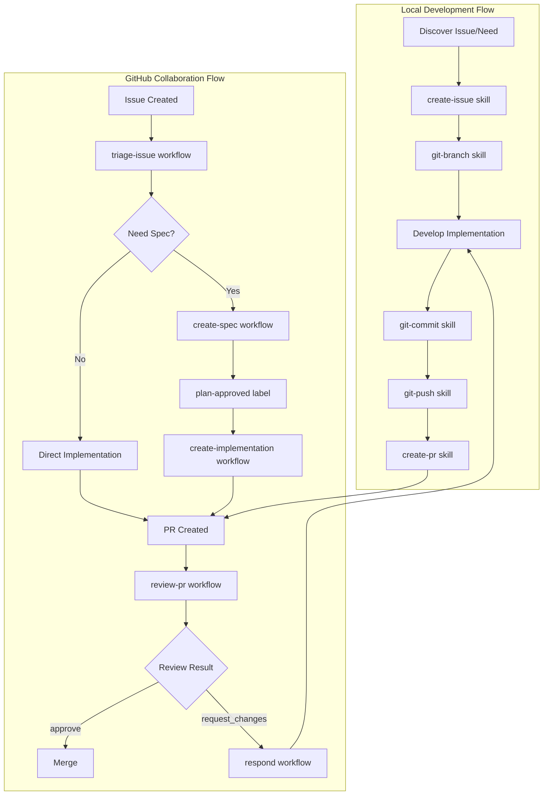
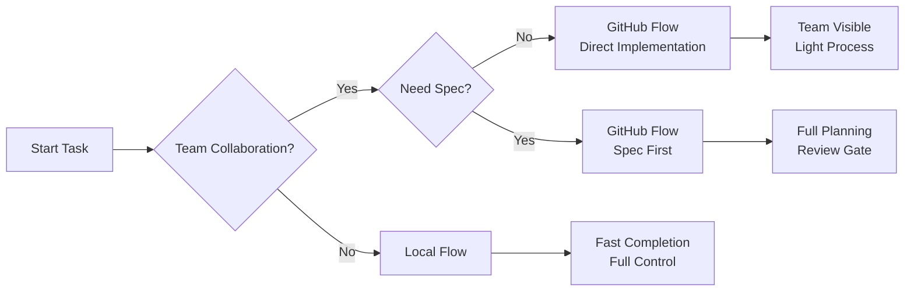

# DevForge-Flow (AICodingFlow)

DevForge-Flow is a workflow template system for AI-assisted coding. It connects local OpenCode Skills, GitHub Actions, PR Review automation, Issue Triage, and Spec-driven development into a stable, reproducible path from planning to implementation to review and merge.

This repository provides two capabilities:

- **Local Development Flow**: Use `create-issue`, `git-*`, and `create-pr` Skills to standardize issue creation, branching, committing, pushing, and PR creation.
- **GitHub Collaboration Flow**: Use GitHub Actions + OpenCode to create specs from issues, implement issues, review PRs, respond to review comments, and update repository-local rules from human feedback.

## Quick Start

One-line installation to target project:

```bash
curl -fsSL https://github.com/jialinamazon404/DevForge-Flow/main/install.sh | bash -s -- --target /path/to/target-repo
```

Or clone and install:

```bash
git clone github.com/jialinamazon404/DevForge-Flow.git
cd AICodingFlow

./install.sh --target /path/to/target-repo
```

Preview files to be written:

```bash
./install.sh --target /path/to/target-repo --dry-run
```

The installation script depends on `bash`, `git`, `rsync`; one-line install also requires `curl`. It syncs `.agents/skills/`, `.github/scripts/`, `.github/aicodingflow-tests/` and managed workflows, but does not sync AICodingFlow's self-use `.github/tests/` and `.github/workflows/ci.yml`.

## Configuration

After installation, configure these in the target repository:

| Name | Type | Purpose |
|------|------|---------|
| `AGENT_API_KEY` | Actions secret | API key for OpenCode action (e.g., Anthropic API Key) |
| `AGENT_MODEL` | Actions variable | Model for OpenCode, e.g., `anthropic/claude-sonnet-4-20250514` |
| `AGENT_LOGIN` | Actions variable | Agent login name for GitHub issue/PR comment mentions |
| `REVIEW_BOT_LOGIN` | Actions variable | Optional. Bot login that posts PR reviews; default `github-actions[bot]`. Needed if review workflow uses different token/bot account. |
| `APP_CLIENT_ID` | Actions variable | GitHub App client ID; used when implementation/comment fix needs to update workflow files |
| `APP_PRIVATE_KEY` | Actions secret | GitHub App private key; App needs `Contents: Read and write` and `Workflows: Read and write` |

If the target project is new to issue triage automation, run in OpenCode:

```text
$bootstrap-issue-config
```

This analyzes existing labels, issues, and contributors, generating or updating `.github/issue-triage/config.json` and `.github/CODEOWNERS`.

---

## Usage Guide

### Local Development Flow Skills

The local development flow provides Skills for common Git operations. Invoke them by name in OpenCode.

#### create-issue

Create a GitHub issue from conversation context or user input.

**Purpose**: Select the best `.github` issue template, fill it conservatively, and submit with GitHub CLI.

**Workflow**:
1. Find repository root and discover issue templates
2. Classify request and select appropriate template (bug, feature, docs, etc.)
3. Route security reports privately (never publish sensitive details)
4. Build title and body from facts only (no invented metadata)
5. Apply metadata only when explicitly requested
6. Create issue with `gh issue create`

**Key Parameters** (implicit from context):
- Template selection: based on request type (bug → bug template, feature → feature template)
- Labels: not added by default (let triage workflow classify)
- Assignees/milestones: only when explicitly requested

**Safety Rules**:
- Never publish secrets, credentials, private keys, personal data
- Use GitHub CLI only; no raw HTTP fallback
- Do not create labels, milestones, branches, or PRs from this skill

#### git-branch

Create a development branch with repository-compliant naming.

**Purpose**: Create correctly-named branches with safety checks.

**Naming Format**: `<type>/<short-desc>-<issueID>`

**Types**: `feat`, `fix`, `refactor`, `docs`, `test`, `perf`, `chore`, `spec`, `impl`

**Workflow**:
1. Determine branch name from issue or user input
2. Validate name with `git check-ref-format --branch`
3. Check local/remote state efficiently
4. Create branch with `git switch -c <branch> <base>`

**Key Parameters**:
| Parameter | Source | Default |
|-----------|--------|---------|
| `type` | Issue context or user input | `chore` |
| `short-desc` | Issue title (via `gh issue view`) or user input | - |
| `issueID` | Issue reference in context | - |
| `base` | Repo guidance or user input | `main` |

**Safety Rules**:
- No overwrite, reset, stash, delete operations unless explicitly asked
- Do not create protected branches (`main`, `master`, `develop`) unless asked
- Never invent issue IDs

#### git-worktree

Create isolated Git worktrees for parallel branch work.

**Purpose**: Enable parallel work on multiple branches without switching.

**Workflow**:
1. Determine worktree path (typically `.worktrees/<branch-name>`)
2. Check for existing worktree conflicts
3. Create worktree with `git worktree add <path> <branch>`
4. Report worktree location

**Key Parameters**:
| Parameter | Source | Default |
|-----------|--------|---------|
| `path` | User input or auto-generated | `.worktrees/<branch>` |
| `branch` | User input or context | - |
| `base` | For new branch creation | `main` |

**Safety Rules**:
- Do not remove worktrees unless explicitly asked
- `.worktrees/` directory must remain in `.gitignore`

#### git-commit

Create clean commits from real diffs with accurate messages.

**Purpose**: Commit atomically with correct messages and no unrelated files.

**Workflow**:
1. Inspect changes: `git status`, `git diff`
2. Determine commit boundaries (split for separate concerns)
3. Stage only intended files
4. Build message in Conventional Commit format
5. Commit with hooks enabled

**Message Format**: `type(scope): summary`

**Issue Linking**:
- `Fixes #123` - when commit closes the issue
- `Refs #123` - for partial or preparatory work

**Key Parameters**:
| Parameter | Source | Default |
|-----------|--------|---------|
| `type` | Change nature | `feat`, `fix`, etc. |
| `scope` | Module/component | Optional |
| `summary` | Change description | From diff |
| `issueID` | Branch pattern or explicit | - |

**Safety Rules**:
- Never use `--no-verify` unless explicitly asked
- Do not push, rewrite history, or force
- Report hook failures without bypassing

#### git-push

Push committed branch work safely.

**Purpose**: Push to correct remote branch with minimal checks.

**Workflow**:
1. Verify branch is ready (committed work)
2. Check remote state (no divergent history)
3. Push with upstream tracking: `git push -u origin <branch>`

**Key Parameters**:
| Parameter | Source | Default |
|-----------|--------|---------|
| `remote` | Repo configuration | `origin` |
| `branch` | Current branch | - |
| `force` | Never unless explicitly asked | `false` |

**Safety Rules**:
- No force push unless explicitly requested
- Warn on divergent history; do not auto-resolve

#### create-pr

Create or update a GitHub pull request.

**Purpose**: Create PR from pushed branch with proper metadata.

**Workflow**:
1. Verify branch pushed to remote
2. Sync with base branch if needed
3. Build PR title and body
4. Create PR with `gh pr create`
5. Link to issue if applicable

**Title Format**: `[#123] type(scope): summary`

**Summary Template**:
```markdown
## What
[One-line description]

## Why
[Reason for change]

## How
[Key implementation details]

## Testing
[How tested]
```

**Key Parameters** (from `pr-metadata.json` or context):
| Parameter | Source | Required |
|-----------|--------|----------|
| `branch_name` | Context or metadata | Yes |
| `pr_title` | Context or metadata | Yes |
| `pr_summary` | Context or metadata | Optional |
| `intended_files` | Context or metadata | Optional |

**Safety Rules**:
- Run review before PR creation when requested
- Do not merge or close PRs from this skill

---

### GitHub Collaboration Flow Workflows

GitHub Actions workflows automate triage, spec creation, implementation, and review.

#### triage-issue.yml

**Triggers**:
- `issues: opened, reopened`
- `issue_comment: created` (non-bot)
- `workflow_dispatch` with `issue` input

**Inputs**:
| Input | Required | Default | Description |
|-------|----------|---------|-------------|
| `issue` | Yes (dispatch) | - | Issue number |
| `agent_login` | No | `AGENT_LOGIN` | Agent login |
| `include_issue_body` | No | `true` | Include issue body in output |

**Output**: `triage_result.json`

**Fields**:
| Field | Type | Description |
|-------|------|-------------|
| `labels` | `array[string]` | Labels to apply (from config) |
| `repro` | `string` | Reproducibility (`high`, `medium`, `low`, `unknown`) |
| `confidence` | `string` | Confidence (`high`, `medium`, `low`) |
| `related_files` | `array[string]` | Related file paths |
| `root_cause` | `string` | Evidence-based assessment |
| `summary` | `string` | Triage conclusion |
| `follow_up_questions` | `array` | Questions for author |
| `duplicate_of` | `array` | Duplicate candidates |
| `issue_body` | `string` | Markdown for comment |

**Constraints**:
- Never include protected labels (`ready-to-spec`, `ready-to-implement`, `plan-approved`)
- `duplicate_of` and `follow_up_questions` are mutually exclusive

#### create-spec-from-issue.yml

**Trigger**: Issue labeled `ready-to-spec`

**Outputs**:
- `specs/issue-<N>/product.md` - Product spec (behavior, UX)
- `specs/issue-<N>/tech.md` - Tech spec (architecture, implementation)
- Spec PR for human review

#### plan-approved.yml

**Trigger**: Spec PR merged (issue gets `plan-approved` label)

**Behavior**:
- Check implementation gates (no conflicts, dependencies satisfied)
- If pass → add `ready-to-implement` label
- If fail → post comment explaining blockers

#### create-implementation-from-issue.yml

**Trigger**: Issue labeled `ready-to-implement`

**Outputs**:
- Implementation commits on feature branch
- Implementation PR
- `implementation_summary.md`

#### review-pr.yml

**Triggers**:
- `workflow_dispatch` with `pr_number`
- `issue_comment: created` with `@AGENT_LOGIN /review`

**Input**:
| Input | Required | Description |
|-------|----------|-------------|
| `pr_number` | Yes (dispatch) | PR number |

**Output**: `review.json`

**Fields**:
| Field | Type | Description |
|-------|------|-------------|
| `verdict` | `string` | `APPROVE`, `REJECT`, or `COMMENT` |
| `body` | `string` | Review summary |
| `comments` | `array` | Inline comments |
| `recommended_reviewers` | `array` | Human reviewer suggestion (max 1) |

#### respond-to-pr-comment.yml

**Trigger**: PR comment with `@AGENT_LOGIN` and command

**Commands**:
| Command | Purpose |
|---------|---------|
| `/explain` | Explain code changes |
| `/implement` | Implement requested change |
| `/review` | Request AI review |
| `/fix` | Fix identified issues |
| `/approve` | Approve previous REQUEST_CHANGES |

#### update-pr-review.yml

**Trigger**: Human changes bot PR review

**Behavior**: Updates `review-pr-repo` companion skill from feedback

#### update-dedupe.yml

**Trigger**: Human closes issue as duplicate

**Behavior**: Updates `dedupe-issue-repo` companion skill from closure

---

## Team Workflow Diagrams

### Overall Collaboration Flow



### Local vs GitHub Flow Decision



---

## Quick Reference

### Branch Naming

| Type | Pattern | Example |
|------|---------|---------|
| Feature | `feat/<desc>-<issue>` | `feat/add-retry-42` |
| Fix | `fix/<desc>-<issue>` | `fix/null-input-15` |
| Refactor | `refactor/<desc>-<issue>` | `refactor/auth-33` |
| Docs | `docs/<desc>-<issue>` | `docs/readme-7` |
| Test | `test/<desc>-<issue>` | `test/unit-21` |
| Spec | `spec/<desc>-<issue>` | `spec/api-99` |
| Implementation | `impl/<desc>-<issue>` | `impl/auth-99` |

### Commit Format

| Type | Format | Example |
|------|--------|---------|
| Feature | `feat(scope): summary` | `feat(auth): add OAuth2` |
| Fix | `fix(scope): summary` | `fix(api): handle null` |
| Docs | `docs: summary` | `docs: update readme` |

### Issue Labels

| Category | Labels | Purpose |
|----------|--------|---------|
| Protected | `ready-to-spec`, `ready-to-implement`, `plan-approved` | Workflow gates (never auto-added) |
| Flow | `triaged`, `needs-info`, `duplicate` | Triage disposition |
| Repro | `repro:high`, `repro:medium`, `repro:low`, `repro:unknown` | Reproducibility |
| Area | `area:workflow`, `area:skills`, `area:specs`, `area:tests` | Code area |
| Type | `bug`, `enhancement`, `documentation` | Issue type |

### PR Commands

| Command | Purpose |
|---------|---------|
| `/explain` | Explain code |
| `/implement` | Implement change |
| `/review` | Request AI review |
| `/fix` | Fix issues |
| `/approve` | Approve previous rejection |

---

## Directory Structure

```
.agents/                         # Multi-tool shared agent config entry
.agents/skills/                  # OpenCode/Codex Skills
.claude/                         # Claude entry directory
.cursor/rules/                   # Cursor rules
.github/workflows/               # GitHub Actions workflows
.github/scripts/                 # Python helpers for workflows
.github/aicodingflow-tests/      # Upstream-managed unittests and fixtures
.github/tests/                   # AICodingFlow repo self-use tests
.github/issue-triage/            # Issue triage config
docs/                            # Detailed documentation
specs/                           # Issue product/tech specs
```

Entry directories `.claude`, `.cursor` are normal directories that reference `.agents` shared content internally. See [Agent Directories](docs/agent-directories.md).

---

## Documentation

- [Conventions](docs/conventions.md) - Complete Git, Label, Spec, PR, Workflow conventions (English)
- [Conventions CN](docs/conventions_CN.md) - 规范文档（中文）
- [Local Development Flow](docs/local-development-flow.md) - Local Skills workflow
- [GitHub Collaboration Flow](docs/github-collaboration-flow.md) - GitHub Actions workflow
- [Agent Directories](docs/agent-directories.md) - `.agents`, `.claude`, `.cursor` structure
- [Evolving Repo Skills](docs/evolving-repo-skills.md) - Companion skill auto-update

---

## Contributing and Feedback

Submit issues or PRs for feedback. For bugs, include:

- Running Skill or workflow
- Branch name, issue number, PR link
- Command output or GitHub Actions logs
- PR review artifacts: `pr_description.txt`, `pr_diff.txt`, `spec_context.md`, `review.json`
- Implementation artifacts: `issue_context.json`, `pr_comment_context.json`, `implementation_summary.md`, `pr-metadata.json`

Test commands:

```bash
python3 -m unittest discover -s .github/tests
python3 -m unittest discover -s .github/aicodingflow-tests
```