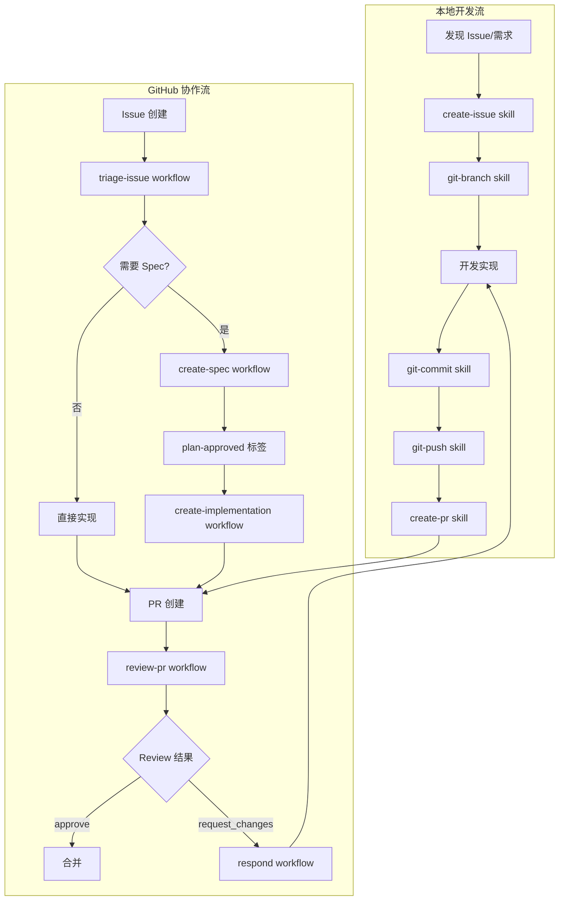
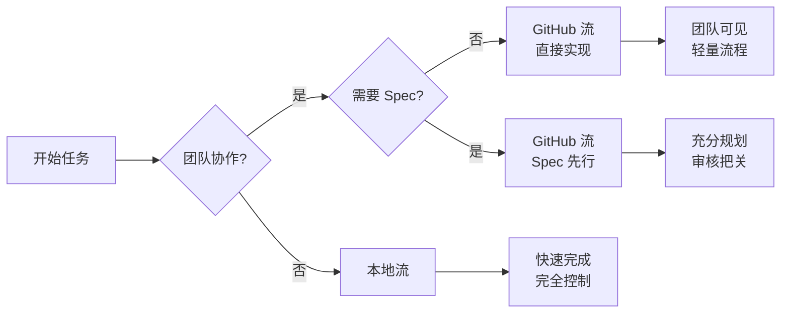

# DevForge-Flow (AICodingFlow)

DevForge-Flow 是一套面向 AI Coding 的工作流模板系统。它将本地 OpenCode Skills、GitHub Actions、PR Review 自动化、Issue Triage 和 Spec 驱动开发连接成一条从规划、实现、审查到合并的稳定、可复现的操作路径。

本仓库提供两类能力：

- **本地开发流**：使用 `create-issue`、`git-*` 和 `create-pr` Skills 规范 Issue 创建、分支、提交、推送和 PR 创建。
- **GitHub 协作流**：使用 GitHub Actions + OpenCode 从 Issue 创建 Spec、实现 Issue、审查 PR、响应 Review 评论，并从人工反馈中更新仓库本地规则。

## 快速开始

一行安装到目标项目：

```bash
curl -fsSL https://github.com/jialinamazon404/DevForge-Flow/main/install.sh | bash -s -- --target /path/to/target-repo
```

或克隆后安装：

```bash
git clone github.com/jialinamazon404/DevForge-Flow.git
cd AICodingFlow

./install.sh --target /path/to/target-repo
```

预览将写入的文件：

```bash
./install.sh --target /path/to/target-repo --dry-run
```

安装脚本依赖 `bash`、`git`、`rsync`；一行安装还需 `curl`。它会同步 `.agents/skills/`、`.github/scripts/`、`.github/aicodingflow-tests/` 和受管工作流，不会同步 AICodingFlow 自用的 `.github/tests/` 和 `.github/workflows/ci.yml`。

## 配置

安装后，在目标仓库配置：

| 名称 | 类型 | 用途 |
|------|------|------|
| `AGENT_API_KEY` | Actions secret | OpenCode action 使用的 API Key（如 Anthropic API Key） |
| `AGENT_MODEL` | Actions variable | OpenCode 使用的模型，如 `anthropic/claude-sonnet-4-20250514` |
| `AGENT_LOGIN` | Actions variable | GitHub Issue/PR 评论中被分配或 mention 的 Agent 登录名 |
| `REVIEW_BOT_LOGIN` | Actions variable | 可选。发布 PR Review 的 Bot 登录名；默认 `github-actions[bot]`。如果 Review 工作流使用其他 token/bot 账号，需设为实际 Review 作者。 |
| `APP_CLIENT_ID` | Actions variable | GitHub App Client ID；Implementation/comment fix 需更新工作流文件时使用 |
| `APP_PRIVATE_KEY` | Actions secret | GitHub App Private Key；App 需要 `Contents: Read and write` 和 `Workflows: Read and write` |

如果目标项目首次接入 Issue Triage 自动化，在 OpenCode 运行：

```text
$bootstrap-issue-config
```

它会分析已有 labels、issues 和 contributors，生成或更新 `.github/issue-triage/config.json` 和 `.github/CODEOWNERS`。

---

## 使用指南

### 本地开发流 Skills

本地开发流提供常用 Git 操作的 Skills。在 OpenCode 中按名称调用。

#### create-issue

从对话上下文或用户输入创建 GitHub Issue。

**用途**：选择最合适的 `.github` Issue 模板，保守填充，用 GitHub CLI 提交。

**工作流**：
1. 查找仓库根目录和发现 Issue 模板
2. 分类请求并选择合适模板（bug、feature、docs 等）
3. 安全报告走私有渠道（禁止公开敏感细节）
4. 仅从事实构建标题和正文（禁止伪造元数据）
5. 仅在明确请求时添加元数据
6. 用 `gh issue create` 创建 Issue

**关键参数**（隐含于上下文）：
- 模板选择：基于请求类型（bug → bug 模板，feature → feature 模板）
- Labels：默认不添加（让 Triage 工作流分类）
- Assignees/milestones：仅在明确请求时添加

**安全规则**：
- 禁止公开 secrets、credentials、private keys、个人数据
- 只用 GitHub CLI；禁止 raw HTTP fallback
- 不从此 Skill 创建 labels、milestones、branches 或 PRs

#### git-branch

创建符合仓库规范的分支。

**用途**：创建正确命名的分支并进行安全检查。

**命名格式**：`<type>/<short-desc>-<issueID>`

**类型**：`feat`, `fix`, `refactor`, `docs`, `test`, `perf`, `chore`, `spec`, `impl`

**工作流**：
1. 从 Issue 或用户输入确定分支名
2. 用 `git check-ref-format --branch` 验证名称
3. 高效检查本地/远程状态
4. 用 `git switch -c <branch> <base>` 创建分支

**关键参数**：
| 参数 | 来源 | 默认值 |
|------|------|--------|
| `type` | Issue 上下文或用户输入 | `chore` |
| `short-desc` | Issue 标题（通过 `gh issue view`）或用户输入 | - |
| `issueID` | 上下文中的 Issue 引用 | - |
| `base` | 仓库指导或用户输入 | `main` |

**安全规则**：
- 禁止 overwrite、reset、stash、delete 操作（除非明确要求）
- 禁止创建保护分支（`main`, `master`, `develop`）（除非明确要求）
- 禁止伪造 Issue ID

#### git-worktree

为并行分支工作创建隔离的 Git Worktree。

**用途**：在多个分支上并行工作而不需要切换。

**工作流**：
1. 确定 Worktree 路径（通常 `.worktrees/<branch-name>`）
2. 检查现有 Worktree 冲突
3. 用 `git worktree add <path> <branch>` 创建 Worktree
4. 报告 Worktree 位置

**关键参数**：
| 参数 | 来源 | 默认值 |
|------|------|--------|
| `path` | 用户输入或自动生成 | `.worktrees/<branch>` |
| `branch` | 用户输入或上下文 | - |
| `base` | 新分支创建时 | `main` |

**安全规则**：
- 禁止移除 Worktree（除非明确要求）
- `.worktrees/` 目录必须保留在 `.gitignore`

#### git-commit

从真实 Diff 创建干净的提交，带准确消息。

**用途**：原子提交，正确消息，不包含无关文件。

**工作流**：
1. 检查变更：`git status`, `git diff`
2. 确定提交边界（分离关注点时拆分）
3. 只暂存意图文件
4. 按 Conventional Commit 格式构建消息
5. 启用 Hooks 提交

**消息格式**：`type(scope): summary`

**Issue 关联**：
- `Fixes #123` - 当提交关闭 Issue
- `Refs #123` - 部分/准备工作

**关键参数**：
| 参数 | 来源 | 默认值 |
|------|------|--------|
| `type` | 变更性质 | `feat`, `fix` 等 |
| `scope` | 模块/组件 | 可选 |
| `summary` | 变更描述 | 从 Diff |
| `issueID` | 分支模式或显式引用 | - |

**安全规则**：
- 禁止 `--no-verify`（除非明确要求）
- 禁止 push、重写历史或 force
- 报告 Hook 失败而不绕过

#### git-push

安全推送已提交的分支工作。

**用途**：推送到正确的远程分支，最小检查。

**工作流**：
1. 验证分支已准备好（已提交工作）
2. 检查远程状态（无分歧历史）
3. 带 upstream tracking 推送：`git push -u origin <branch>`

**关键参数**：
| 参数 | 来源 | 默认值 |
|------|------|--------|
| `remote` | 仓库配置 | `origin` |
| `branch` | 当前分支 | - |
| `force` | 永不（除非明确要求） | `false` |

**安全规则**：
- 禁止 force push（除非明确要求）
- 分歧历史时警告；不自动解决

#### create-pr

创建或更新 GitHub Pull Request。

**用途**：从已推送分支创建 PR，带正确元数据。

**工作流**：
1. 验证分支已推送到远程
2. 如需要与 base 分支同步
3. 构建 PR 标题和正文
4. 用 `gh pr create` 创建 PR
5. 如适用，关联 Issue

**标题格式**：`[#123] type(scope): summary`

**Summary 模板**：
```markdown
## What
[一行描述]

## Why
[变更原因]

## How
[关键实现细节]

## Testing
[如何测试]
```

**关键参数**（从 `pr-metadata.json` 或上下文）：
| 参数 | 来源 | 必需 |
|------|------|------|
| `branch_name` | 上下文或 metadata | 是 |
| `pr_title` | 上下文或 metadata | 是 |
| `pr_summary` | 上下文或 metadata | 可选 |
| `intended_files` | 上下文或 metadata | 可选 |

**安全规则**：
- 请求时在创建 PR 前运行 Review
- 不从此 Skill 合并或关闭 PR

---

### GitHub 协作流工作流

GitHub Actions 工作流自动化 Triage、Spec 创建、Implementation 和 Review。

#### triage-issue.yml

**触发条件**：
- `issues: opened, reopened`
- `issue_comment: created`（非 Bot）
- `workflow_dispatch` 带 `issue` 输入

**输入参数**：
| 输入 | 必需 | 默认值 | 描述 |
|------|------|--------|------|
| `issue` | 是（dispatch） | - | Issue 编号 |
| `agent_login` | 否 | `AGENT_LOGIN` | Agent 登录名 |
| `include_issue_body` | 否 | `true` | 输出中包含 Issue 正文 |

**输出**：`triage_result.json`

**字段**：
| 字段 | 类型 | 描述 |
|------|------|------|
| `labels` | `array[string]` | 要应用的标签（从 config） |
| `repro` | `string` | 可复现性（`high`, `medium`, `low`, `unknown`） |
| `confidence` | `string` | 置信度（`high`, `medium`, `low`） |
| `related_files` | `array[string]` | 相关文件路径 |
| `root_cause` | `string` | 基于证据的评估 |
| `summary` | `string` | Triage 结论 |
| `follow_up_questions` | `array` | 向作者提问 |
| `duplicate_of` | `array` | 重复候选 |
| `issue_body` | `string` | 评论 Markdown |

**约束**：
- 禁止包含保护标签（`ready-to-spec`, `ready-to-implement`, `plan-approved`）
- `duplicate_of` 和 `follow_up_questions` 互斥

#### create-spec-from-issue.yml

**触发条件**：Issue 获得 `ready-to-spec` 标签

**输出**：
- `specs/issue-<N>/product.md` - Product Spec（行为、UX）
- `specs/issue-<N>/tech.md` - Tech Spec（架构、实现）
- Spec PR 供人工审核

#### plan-approved.yml

**触发条件**：Spec PR 合并（Issue 获得 `plan-approved` 标签）

**行为**：
- 检查实现关口（无冲突、依赖已满足）
- 通过 → 添加 `ready-to-implement` 标签
- 失败 → 发布评论说明阻塞原因

#### create-implementation-from-issue.yml

**触发条件**：Issue 获得 `ready-to-implement` 标签

**输出**：
- Feature 分支上的实现提交
- 实现 PR
- `implementation_summary.md`

#### review-pr.yml

**触发条件**：
- `workflow_dispatch` 带 `pr_number`
- `issue_comment: created` 包含 `@AGENT_LOGIN /review`

**输入**：
| 输入 | 必需 | 描述 |
|------|------|------|
| `pr_number` | 是（dispatch） | PR 编号 |

**输出**：`review.json`

**字段**：
| 字段 | 类型 | 描述 |
|------|------|------|
| `verdict` | `string` | `APPROVE`, `REJECT`, 或 `COMMENT` |
| `body` | `string` | Review 汇总 |
| `comments` | `array` | 行内评论 |
| `recommended_reviewers` | `array` | 人工审核者建议（最多 1） |

#### respond-to-pr-comment.yml

**触发条件**：PR 评论包含 `@AGENT_LOGIN` 和命令

**命令**：
| 命令 | 用途 |
|------|------|
| `/explain` | 解释代码变更 |
| `/implement` | 实现请求的变更 |
| `/review` | 请求 AI Review |
| `/fix` | 修复已识别问题 |
| `/approve` | 批准之前的 REQUEST_CHANGES |

#### update-pr-review.yml

**触发条件**：人工修改 Bot PR Review

**行为**：从反馈更新 `review-pr-repo` Companion Skill

#### update-dedupe.yml

**触发条件**：人工将 Issue 关闭为重复

**行为**：从关闭更新 `dedupe-issue-repo` Companion Skill

---

## 团队工作流图

### 整体协作流程



### 本地 vs GitHub 流决策



---

## 快速参考

### 分支命名

| 类型 | 格式 | 示例 |
|------|------|------|
| 功能 | `feat/<desc>-<issue>` | `feat/add-retry-42` |
| 修复 | `fix/<desc>-<issue>` | `fix/null-input-15` |
| 重构 | `refactor/<desc>-<issue>` | `refactor/auth-33` |
| 文档 | `docs/<desc>-<issue>` | `docs/readme-7` |
| 测试 | `test/<desc>-<issue>` | `test/unit-21` |
| Spec | `spec/<desc>-<issue>` | `spec/api-99` |
| 实现 | `impl/<desc>-<issue>` | `impl/auth-99` |

### 提交格式

| 类型 | 格式 | 示例 |
|------|------|------|
| 功能 | `feat(scope): summary` | `feat(auth): add OAuth2` |
| 修复 | `fix(scope): summary` | `fix(api): handle null` |
| 文档 | `docs: summary` | `docs: update readme` |

### Issue Labels

| 类别 | Labels | 用途 |
|------|--------|------|
| 保护 | `ready-to-spec`, `ready-to-implement`, `plan-approved` | 工作流关口（禁止自动添加） |
| 流程 | `triaged`, `needs-info`, `duplicate` | Triage 处置 |
| 可复现 | `repro:high`, `repro:medium`, `repro:low`, `repro:unknown` | 可复现性 |
| 区域 | `area:workflow`, `area:skills`, `area:specs`, `area:tests` | 代码区域 |
| 类型 | `bug`, `enhancement`, `documentation` | Issue 类型 |

### PR 命令

| 命令 | 用途 |
|------|------|
| `/explain` | 解释代码 |
| `/implement` | 实现变更 |
| `/review` | 请求 AI Review |
| `/fix` | 修复问题 |
| `/approve` | 批准之前的拒绝 |

---

## 目录结构

```
.agents/                         # 多工具共享 Agent 配置入口
.agents/skills/                  # OpenCode/Codex Skills
.claude/                         # Claude 入口目录
.cursor/rules/                   # Cursor rules
.github/workflows/               # GitHub Actions 工作流
.github/scripts/                 # Python 工作流辅助脚本
.github/aicodingflow-tests/      # 上游管理 unittest 和 fixtures
.github/tests/                   # AICodingFlow 仓库自用测试
.github/issue-triage/            # Issue triage 配置
docs/                            # 详细文档
specs/                           # Issue product/tech specs
```

入口目录 `.claude`、`.cursor` 是普通目录，内部按工具需要引用 `.agents` 共享内容。详见 [Agent Directories](agent-directories.md)。

---

## 文档

- [Conventions](conventions.md) - 完整 Git、Label、Spec、PR、Workflow 规范（英文）
- [Conventions CN](conventions_CN.md) - 规范文档（中文）
- [Local Development Flow](local-development-flow.md) - 本地 Skills 工作流
- [GitHub Collaboration Flow](github-collaboration-flow.md) - GitHub Actions 工作流
- [Agent Directories](agent-directories.md) - `.agents`、`.claude`、`.cursor` 结构
- [Evolving Repo Skills](evolving-repo-skills.md) - Companion Skill 自动更新

---

## 贡献和反馈

通过 Issue 或 PR 提交反馈。Bug 报告请尽量包含：

- 运行的 Skill 或工作流
- 分支名、Issue 编号、PR 链接
- 命令输出或 GitHub Actions 日志
- PR Review artifacts: `pr_description.txt`, `pr_diff.txt`, `spec_context.md`, `review.json`
- Implementation artifacts: `issue_context.json`, `pr_comment_context.json`, `implementation_summary.md`, `pr-metadata.json`

测试命令：

```bash
python3 -m unittest discover -s .github/tests
python3 -m unittest discover -s .github/aicodingflow-tests
```